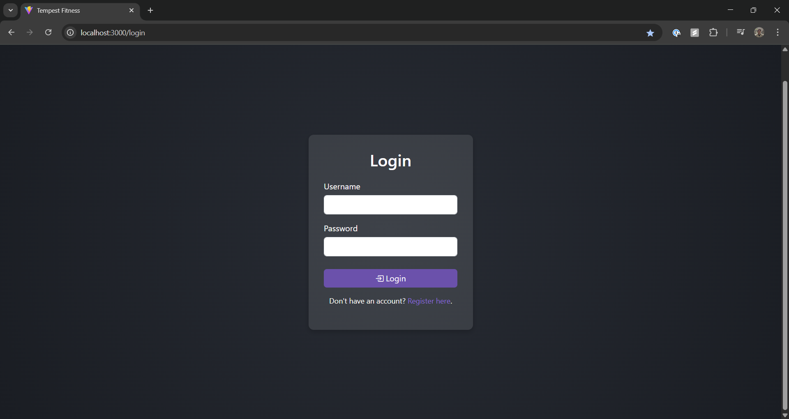

# Tempest-Fitness

**Tempest-Fitness** is a comprehensive fitness tracking application designed to help users monitor and manage their weight, exercises, and workouts. The application provides a user-friendly interface to store, display, and analyze fitness data, empowering users to achieve their health goals effectively. I personally have interest in fitness activities, such as weightlifting and long-distance running. I made this application to help me with my own fitness goals and I hope I can continue to work on this to introduce new features with data visualization and calorie tracking.

# Application Preview
Click on the thumbnail to be redirected to the demo.
[](https://youtu.be/TCfRo5PG9Xg)

## Features

- **User Authentication:** Secure login and registration system to protect user data.
- **Weight Tracking:** Record and view weight entries, sortable in ascending or descending order.
- **Exercise Management:** Create, update, and categorize exercises tailored to individual routines.
- **Workout Planning:** Develop and track workouts by combining various exercises.
- **User Profile:** Visually appealing representation of the user's personal information.

## Technologies Used

**Backend:**
- **Java Spring Boot:** Framework for building the RESTful API and handling business logic.
- **Spring Security:** Manages authentication and authorization processes.
- **Maven:** Dependency management and project build automation.
- **H2 Database:** In-memory database for development and testing purposes.

**Frontend:**
- **React:** JavaScript library for building dynamic user interfaces.
- **Vite:** Next-generation frontend tooling for fast development and build processes.
- **Fetch:** Promise-based HTTP client for making asynchronous requests to the backend API.
- **React Router:** Declarative routing for React applications.

## Installation

Follow these steps to set up the Tempest-Fitness application locally:

### Prerequisites

- **Node.js:** Download and install from [Node.js official website](https://nodejs.org/).
- **Java Development Kit (JDK):** Ensure JDK 21. Download from [Oracle's official website](https://www.oracle.com/java/technologies/javase-jdk21-downloads.html).
- **Maven:** Install Maven for project build automation. Instructions are available on the [Maven website](https://maven.apache.org/install.html).

### Backend Setup

1. **Clone the Repository:**

   ```bash
   git clone https://github.com/hpatel-27/Tempest-Fitness.git
   ```
2. **Navigate to the Backend Directory:**

   ```bash
   cd Tempest-Fitness/tempest-backend
   ```
3. **Build the Project:**

   ```bash
   ./mvnw clean install
   ```
4. **Run the Application:**

   ```bash
   ./mvnw spring-boot:run
   ```
   The backend server will start at `http://localhost:8080`.

### Frontend Setup

1. **Navigate to the Frontend Directory:**

   ```bash
   cd ../tempest-frontend
   ```
2. **Install Dependencies:**

   ```bash
   npm install
   ```
3. **Start the Development Server:**

   ```bash
   npm run dev
   ```
   Access the frontend application at `http://localhost:3000`.
   
# Directory Structure:
```
|-- Tempest-Fitness
|   |-- Tempest-Fitness
|   |   |-- mvnw
|   |   |-- mvnw.cmd
|   |   |-- pom.xml
|   |   `-- src
|   |       |-- main
|   |       |   |-- java
|   |       |   |   `-- com
|   |       |   |       `-- hpatel
|   |       |   |           `-- Tempest_Fitness
|   |       |   |               |-- TempestFitnessApplication.java
|   |       |   |               |-- config
|   |       |   |               |   |-- CustomUserDetailsService.java
|   |       |   |               |   |-- SecurityConfig.java
|   |       |   |               |   `-- UserInitializer.java
|   |       |   |               |-- controllers
|   |       |   |               |   |-- APIController.java
|   |       |   |               |   |-- AuthController.java
|   |       |   |               |   |-- ExerciseController.java
|   |       |   |               |   |-- UserController.java
|   |       |   |               |   |-- UserExerciseController.java
|   |       |   |               |   |-- WeightController.java
|   |       |   |               |   `-- WorkoutController.java
|   |       |   |               |-- dto
|   |       |   |               |   `-- LoginRequest.java
|   |       |   |               |-- models
|   |       |   |               |   |-- DomainObject.java
|   |       |   |               |   |-- Exercise.java
|   |       |   |               |   |-- User.java
|   |       |   |               |   |-- UserExercise.java
|   |       |   |               |   |-- Weight.java
|   |       |   |               |   `-- Workout.java
|   |       |   |               |-- repositories
|   |       |   |               |   |-- ExerciseRepository.java
|   |       |   |               |   |-- UserExerciseRepository.java
|   |       |   |               |   |-- UserRepository.java
|   |       |   |               |   |-- WeightRepository.java
|   |       |   |               |   `-- WorkoutRepository.java
|   |       |   |               |-- services
|   |       |   |               |   |-- CustomService.java
|   |       |   |               |   |-- ExerciseService.java
|   |       |   |               |   |-- UserExerciseService.java
|   |       |   |               |   |-- UserService.java
|   |       |   |               |   |-- WeightService.java
|   |       |   |               |   `-- WorkoutService.java
|   |       |   |               `-- utility
|   |       |   `-- resources
|   |       |       |-- application.properties
|   |       |       |-- static
|   |       |       `-- templates
|   |       `-- test
|   |           |-- java
|   |           |   `-- com
|   |           |       `-- hpatel
|   |           |           `-- Tempest_Fitness
|   |           |               |-- DBInteractionTest.java
|   |           |               |-- TempestFitnessApplicationTests.java
|   |           |               |-- TestConfig.java
|   |           |               |-- common
|   |           |               |   `-- TestUtils.java
|   |           |               |-- controllers
|   |           |               |   |-- APIExerciseTest.java
|   |           |               |   |-- APIUserTest.java
|   |           |               |   |-- APIWeightTest.java
|   |           |               |   `-- APIWorkoutTest.java
|   |           |               `-- models
|   |           |                   |-- ExerciseTest.java
|   |           |                   |-- UserExerciseTest.java
|   |           |                   |-- UserTest.java
|   |           |                   |-- WeightTest.java
|   |           |                   `-- WorkoutTest.java
|   |           `-- resources
|   |               `-- application-test.properties
|   |-- docs
|   |   |-- Demo.mp4
|   |   |-- LoginPage.png
|   |   `-- RegisterPage.png
|   `-- tempest-frontend
|       |-- README.md
|       |-- eslint.config.js
|       |-- index.html
|       |-- package-lock.json
|       |-- package.json
|       |-- public
|       |   `-- thunder.svg
|       |-- src
|       |   |-- App.jsx
|       |   |-- assets
|       |   |   `-- storm_weather.png
|       |   |-- components
|       |   |   |-- Exercises.jsx
|       |   |   |-- Home.jsx
|       |   |   |-- Login.jsx
|       |   |   |-- NavBar.jsx
|       |   |   |-- Profile.jsx
|       |   |   |-- ProtectedRoute.jsx
|       |   |   |-- Register.jsx
|       |   |   |-- Weights.jsx
|       |   |   `-- Workouts.jsx
|       |   |-- contexts
|       |   |   `-- AuthContext.jsx
|       |   |-- main.jsx
|       |   |-- providers
|       |   |   `-- AuthProvider.jsx
|       |   |-- services
|       |   |   |-- exerciseService.js
|       |   |   |-- userService.js
|       |   |   |-- weightService.js
|       |   |   `-- workoutService.js
|       |   `-- styles
|       |       |-- exercise.css
|       |       |-- home.css
|       |       |-- index.css
|       |       |-- login.css
|       |       |-- navbar.css
|       |       |-- register.css
|       |       `-- weight.css
|       `-- vite.config.js

37 directories, 87 files
```

